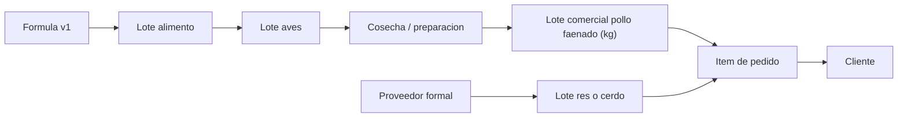

# Modelo De Datos Inicial

## Objetivo

El sistema debe responder una pregunta fundamental:

> De donde vino cada producto, cuanto costo, a quien se vendio y que margen
> dejo?

Por eso los pedidos no pueden existir separados de inventario y lotes.

## Nucleos De Datos

### Identidad y acceso

| Entidad | Campos esenciales |
| --- | --- |
| `organizations` | id, name, tax_id, status |
| `profiles` | id, user_id, full_name, phone, status |
| `roles` | id, key, name |
| `profile_roles` | profile_id, role_id, organization_id |
| `audit_events` | actor_id, action, entity, entity_id, previous, next, occurred_at |

Roles iniciales: `owner`, `admin`, `ventas`, `almacen`, `produccion`,
`molino`, `delivery`, `contabilidad` y `auditor`.

### Catalogo y ventas

| Entidad | Campos esenciales |
| --- | --- |
| `products` | id, sku, name, category_id, origin_type, traceable, active |
| `product_variants` | id, product_id, unit, estimated_weight, sale_price, cost_basis |
| `price_lists` | id, channel, customer_segment, valid_from, valid_to |
| `price_list_items` | price_list_id, variant_id, price, promotional_price |
| `customers` | id, type, name, document, phone, email |
| `addresses` | customer_id, zone_id, address, reference, coordinates |
| `orders` | id, number, customer_id, channel, status, totals, delivery_slot_id |
| `order_items` | order_id, variant_id, lot_id, quantity, unit_price, subtotal |
| `subscriptions` | customer_id, pack_id, frequency, next_delivery, status |
| `payments` | order_id, provider, method, amount, status, external_reference |

`origin_type` empieza con `own`, `selected_supplier` y
`pending_confirmation`. En el futuro puede incorporar `partner_farm` sin
falsear el origen.

### Compras, stock y trazabilidad

| Entidad | Campos esenciales |
| --- | --- |
| `suppliers` | id, name, tax_id, supplies, approval_status |
| `purchase_orders` | id, supplier_id, status, expected_at, total |
| `purchase_items` | purchase_order_id, input_or_product_id, quantity, unit_cost |
| `lots` | id, code, product_id, origin_type, source_id, created_at, expiry_at |
| `inventory_movements` | lot_id, type, quantity, unit, location_id, reference |
| `quality_checks` | lot_id, check_type, value, result, evidence_url |
| `cold_chain_records` | lot_id, stage, temperature, recorded_at, actor_id |
| `delivery_slots` | zone_id, date, time_range, capacity, fee |

La res y el cerdo comprados ya faenados nacen como `inventory_lots`
asociados a proveedor. El pollito vivo nunca es inventario comercial: nace
como `bird_batches` y solo después de la faena genera un `inventory_lot` de
pollo propio en kilogramos. Huevos y cuy no adoptan sello de origen hasta
que la empresa confirme y registre su procedencia.

### Produccion propia

| Entidad | Campos esenciales |
| --- | --- |
| `production_units` | id, type, name, capacity, status |
| `bird_batches` | id, code, breed, received_at, initial_count, current_count, processed_count, stage, unit_id |
| `bird_batch_events` | batch_id, event_type, event_at, count, avg_weight_grams, feed_kg, feed_unit_cost, amount, expense_category, mill_batch_id, notes |
| `layer_flocks` | id, code, location_id, started_at, initial_hens, current_hens, available_eggs, packed_maples, cost_per_hen, status |
| `layer_flock_events` | flock_id, event_type, event_at, count, feed_kg, feed_unit_cost, amount, expense_category, mill_batch_id, notes |
| `egg_collections` | flock_id, collected_at, collected_eggs, rejected_eggs, notes |
| `feed_consumption` | batch_id, formula_version_id, quantity_kg, consumed_at |
| `harvest_batches` | bird_batch_id, lot_id, processed_at, final_weight_kg |

Los eventos de alimento pueden llevar costo por kg y los eventos de gasto
clasifican sanidad, cama, energia, mano de obra, transporte u otros costos.
Los consumos todavia sin costo permanecen visibles como pendientes de
valorizacion y se pueden valorizar posteriormente desde el tablero del lote.
Cuando se selecciona alimento producido en Molino, el costo se toma del lote
y el saldo se descuenta en la misma transaccion.

Indicadores calculables: mortalidad, supervivencia, evolucion de peso,
consumo por ave, conversion alimenticia referencial, costo acumulado y costo
por ave o kg vivo antes de faena.

Para huevos, la recoleccion suma unidades aptas disponibles y el empaque
descarga 30 huevos por maple para generar `inventory_lots` vendibles,
relacionados al lote de ponedoras. Asi se calculan postura reciente, tasa de
aprovechamiento y costo por absorcion acumulada por huevo o maple, que
incluye la inversion de ponedoras y se estabiliza al avanzar el ciclo.

### Molino

| Entidad | Campos esenciales |
| --- | --- |
| `feed_inputs` | id, name, unit, active |
| `feed_input_prices` | feed_input_id, supplier_id, effective_date, cost_per_unit |
| `suppliers` | id, name, tax_id, category, status |
| `feed_input_lots` | code, input_id, supplier_id, location_id, received_kg, available_kg, unit_cost, document_reference, quality_status |
| `feed_input_lot_movements` | lot_id, movement_type, quantity_delta, mill_batch_id, actor_id |
| `feed_formulas` | id, name, species, stage, status |
| `feed_formula_versions` | formula_id, version, approval_status, target_kg, validated_at |
| `feed_formula_items` | formula_version_id, input_id, percentage, quantity_kg |
| `mill_orders` | id, type, customer_id, formula_version_id, requested_kg, status |
| `mill_batches` | version_id, code, usage, produced_kg, available_kg, total_cost, cost_per_kg, produced_at |
| `mill_batch_input_consumptions` | mill_batch_id, input_lot_id, quantity_kg, unit_cost, amount |

Reglas obligatorias:

- Una version de formula aprobada debe totalizar exactamente `100%`.
- Un ingrediente activo debe tener costo vigente para costear el lote.
- Un consumo interno no puede exceder `available_kg` ni usar un lote destinado
  a otra linea productiva.
- Una molienda solo consume insumos con `quality_status = approved` y el
  costo del lote molido se calcula desde esas recepciones reales por FIFO.
- Alimento para venta debe conservar version, lote, insumos y responsable.

Implementacion inicial: las formulas de `Alimentacion Actual.xlsx` se cargan
como versiones borrador para lotes objetivo de 40 kg. Se registra la
diferencia contra el objetivo y se bloquea la aprobacion hasta alcanzar el
total esperado y contar con costo vigente para cada insumo utilizado.

### Circularidad

| Entidad | Campos esenciales |
| --- | --- |
| `byproduct_entries` | source_batch_id, type, quantity_kg, recorded_at |
| `circular_processes` | id, type, started_at, finished_at, status |
| `circular_inputs` | process_id, byproduct_entry_id, quantity_kg |
| `circular_outputs` | process_id, lot_id, product_id, quantity_kg |

## Flujo De Trazabilidad

## Primeras Migraciones

1. Identidad, roles y auditoria.
2. Catalogo, variantes, listas de precios y clientes.
3. Pedidos, items, pagos, zonas y franjas de entrega.
4. Proveedores, lotes, inventario y calidad.
5. Produccion avicola, huevos y consumo de alimento.
6. Molino y versionado de formulas.
7. Descuento trazable del alimento molido en crianza y ponedoras.
8. Recepcion, calidad y consumo FIFO de insumos; tablero de auditoria.
9. Circularidad e indicadores.
