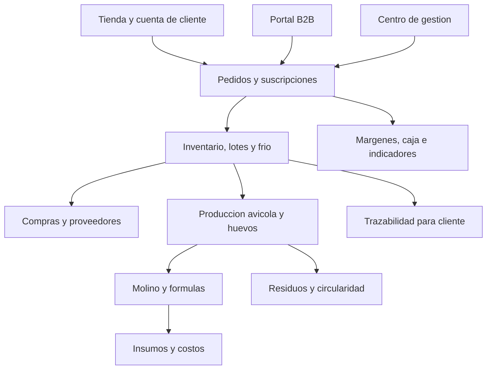

# Plataforma Empresarial BioGranja 51

## Vision

BioGranja 51 sera una empresa de proteinas, nutricion animal y produccion
circular. La plataforma no se plantea como una pagina de catalogo: es el
sistema operativo que conecta comercializacion, abastecimiento, produccion,
molino, trazabilidad y rentabilidad.

## Principio de marca

El cliente debe comprender el origen de cada producto:

| Sello | Uso | Ejemplos iniciales |
| --- | --- | --- |
| `BioGranja Origen` | Producido directamente por la empresa y respaldado por lote | Pollo confirmado; huevos cuando se valide su procedencia |
| `BioGranja Seleccion` | Comprado a proveedor formal y controlado por BioGranja | Res, cerdo |
| `Origen por confirmar` | Producto comercial disponible sin afirmar procedencia aun | Huevos y cuy en el arranque |
| `BioGranja Molino` | Servicio de molienda o alimento formulado y validado | Formulas avicolas |
| `BioGranja Circular` | Productos resultantes del aprovechamiento productivo | Compost futuro |

No se publicaran afirmaciones de salud o de produccion propia que no puedan
respaldarse con datos, registros y evidencias.

## Canales del negocio

| Canal | Cliente | Experiencia requerida |
| --- | --- | --- |
| Tienda web | Hogares | Catalogo, packs, carrito, horario de entrega y pago |
| Suscripciones | Hogares recurrentes | Caja semanal/quincenal, cambios y pausas |
| WhatsApp asistido | Hogares y leads | Pedido ya registrado con numero de orden |
| Venta B2B | Restaurantes y tiendas | Listas de precios, volumen, credito y despacho |
| Molino | Productores | Orden de molienda, formula, lote y costo/servicio |

## Arquitectura funcional

## Modulos

### 1. Comercio

- Catalogo con categorias, presentaciones, precios, promociones y origen.
- Carrito con precios calculados en servidor, no en el navegador.
- Pedidos con delivery, retiro, franjas horarias y estado.
- Packs y suscripciones.
- Canal B2B con precios por volumen.
- Integracion posterior con pago online y comprobantes.

### 2. Clientes y relacion

- Perfil, direcciones, historial y preferencias.
- Segmentos: hogar, recurrente, fitness, parrilla, restaurante y distribuidor.
- Recuperacion de clientes inactivos y recompra.
- Atencion por WhatsApp enlazada a un pedido real.

### 3. Abastecimiento e inventario

- Proveedores de res, cerdo, insumos de molino, empaques y servicios.
- Recepcion con peso, costo, temperatura, documento y evidencia.
- Lotes de producto, ubicacion, fechas, mermas y stock disponible.
- Separacion estricta entre producto propio y producto seleccionado.

### 4. Produccion avicola y huevos

- Galpones o unidades productivas.
- Lotes de aves, ingreso, mortalidad, peso de muestra y conversion.
- Consumo de alimento por etapa y costo real por ave/kg.
- Produccion de huevos por lote, clasificacion y merma.
- Alertas sanitarias y registros operativos.
- Separacion estricta entre ave viva en crianza y pollo faenado listo para
  inventario: la faena crea el lote comercial asociado al lote productivo.

### 5. Molino y nutricion

- Catalogo de insumos y precios historicos.
- Formulas versionadas por especie y etapa.
- Ordenes de produccion, consumo real, rendimiento y costo por kg.
- Saldo de alimento por lote, descontado al registrar consumo de pollos o
  ponedoras con costo heredado de la formula aprobada.
- Compras de insumos recibidas por lote, proveedor, comprobante y calidad;
  la molienda descuenta stock liberado y obtiene su costo real.
- Servicio a terceros separado de consumo interno.
- Publicacion comercial solo de formulas aprobadas y trazables.

### 6. Circularidad

- Registro de estiércol, cama, subproductos y descarte.
- Procesos de compostaje o valorizacion.
- Producto final, lote, rendimiento y venta/uso interno.
- Indicadores verificables del sistema 360.

### 7. Direccion y finanzas

- Margen real por producto, canal, pedido y lote.
- Costo de alimento, crianza, compra, empaque, frio y reparto.
- Tablero ejecutivo, flujo de caja y metas.
- Auditoria de cambios de precio, stock y estado sanitario.

## Arquitectura tecnica recomendada

Comenzar como un **monolito modular**: una aplicacion consistente y una sola
base transaccional, con limites de dominio claros. Es la forma mas rapida de
lograr control empresarial sin asumir el costo operativo de microservicios.

| Capa | Eleccion inicial | Responsabilidad |
| --- | --- | --- |
| Aplicacion web | Next.js + TypeScript | Tienda, portal B2B y centro de gestion |
| Datos | PostgreSQL gestionado mediante Supabase | Transacciones y trazabilidad |
| Usuarios | Supabase Auth + RLS | Accesos por rol y proteccion de datos |
| Archivos | Supabase Storage | Imagenes, evidencias, guias y documentos |
| Pagos | WhatsApp registrado; pasarela en fase siguiente | Confirmacion y conciliacion |
| Analitica | Eventos propios + tablero | Conversion, margen y operacion |
| Despliegue | Entorno de pruebas y produccion separados | Liberaciones controladas |

## Implementacion Inicial Construida

- Catalogo comercial centralizado con pollo entero, maple de huevos, res y
  cerdo en 500 g, y cuy entero.
- Editor local de productos, precios, publicacion, suscripcion e imagen.
- Cotizador comercial con zonas iniciales de Trujillo y medios Yape, Plin y
  transferencia.
- Configuracion de una tienda comercial, almacen/molino y granja, preparada
  para replicar sedes.
- Migracion PostgreSQL/Supabase con productos, pedidos, lotes, roles,
  auditoria y politicas de seguridad.
- CRM comercial con consolidacion por celular, historial de compra, notas,
  segmentacion e interes en suscripcion.
- Inventario operativo con recepcion de lotes, costo unitario, merma,
  saldo valorizado y reserva de lote por pedido.
- Crianza avicola con ingreso de pollitos, seguimiento de mortalidad, peso y
  alimento, y salida faenada que alimenta inventario comercial.
- Produccion de huevos con lotes de ponedoras, postura, descarte, costo
  acumulado y empaque de maples trazable hacia inventario.
- Molino con insumos valorizados, formulas versionadas y lotes de alimento
  internos costeados por kilogramo para crianza y ponedoras.
- Enlace Molino-Produccion que descuenta alimento por lote y lleva su costo
  real al tablero productivo.
- Auditoria operativa con bitacora y hallazgos automáticos de costo o
  trazabilidad incompleta.

El almacenamiento JSON habilita validacion inmediata en desarrollo. Antes de
despliegue comercial, la aplicacion debe conectar Supabase Auth, PostgreSQL y
Storage; las mutaciones administrativas permanecen bloqueadas en produccion
hasta completar ese control.

## Seguridad y control

- Todo cambio de precio, stock, formula o estado de pedido queda auditado.
- Los clientes solo acceden a sus propios pedidos y trazabilidad publica.
- Roles internos aplican principio de minimo privilegio.
- Pagos y totales se calculan en servidor.
- Fotos, documentos y datos sensibles se almacenan con permisos.
- Copias de seguridad y migraciones de base de datos son obligatorias.

## Requisitos regulatorios a contemplar

- Proveedores formales, documentacion de origen y control de cadena de frio.
- Faenamiento de animales en instalaciones autorizadas para esa actividad.
- Formalizacion sanitaria antes de comercializar alimento producido en molino.
- Revision aplicable para productos transformados como hamburguesas o marinados.
- Registro de lotes y rastreabilidad como requisito del producto, no como extra.

El cumplimiento concreto debera validarse con los profesionales sanitarios y
contables correspondientes antes de operar cada nueva linea.
